# MyLinear — OpenSpec SDD 全阶段执行计划

## 概述

基于 [路线图.md](路线图.md) 中 104 项功能的 5 阶段规划，使用 OpenSpec SDD（Spec-Driven Development）工作流组织开发。全部功能划分为 **42 个 change**。

### OpenSpec 标准工作流

每个 change 按以下流程执行：

```
proposal ──► specs ──► design ──► tasks ──► implement ──► verify ──► archive
    │           │          │          │          │            │           │
   why        what        how       steps      code       check       merge
 + scope    changes    approach   to take                specs       to SoT
```

| 阶段             | 产出物                 | 说明                                                              |
| ---------------- | ---------------------- | ----------------------------------------------------------------- |
| `/opsx:new`      | 创建 change 目录       | 初始化变更文件夹                                                  |
| `/opsx:continue` | `proposal.md`          | Intent / Scope / Approach                                         |
| `/opsx:continue` | `specs/` (Delta Specs) | ADDED/MODIFIED/REMOVED Requirements + Scenarios (GIVEN/WHEN/THEN) |
| `/opsx:continue` | `design.md`            | Technical Approach / Architecture Decisions / Data Flow           |
| `/opsx:continue` | `tasks.md`             | 分组实现清单（带 checkbox）                                       |
| `/opsx:apply`    | 代码实现               | 按 tasks.md 逐项实现                                              |
| `/opsx:verify`   | 验证                   | Completeness / Correctness / Coherence                            |
| `/opsx:archive`  | 归档                   | Delta Specs 合并至 `openspec/specs/`，change 移入 `archive/`      |

### Change 粒度划分原则

| 原则         | 说明                                                          |
| ------------ | ------------------------------------------------------------- |
| **依赖驱动** | 按依赖关系排序，被依赖的先行                                  |
| **垂直切片** | 每个 change 尽量包含完整的 后端+前端+数据模型，形成可交付功能 |
| **单一聚焦** | 每个 change 聚焦一个领域，避免交叉耦合                        |
| **适中规模** | 每个 change 对应 1~2 周工作量，太大拆分、太小合并             |

### 全局进度追踪

> **状态说明**：⏳ 待开始 | 🚧 进行中 | ✅ 已完成 | ❌ 已取消

#### Phase 1 — MVP 核心（13 changes）

| Change | 名称                 | 状态  | 归档日期   |
| ------ | -------------------- | :---: | ---------- |
| C01    | 项目脚手架与基础设施 |   ✅   | 2026-02-16 |
| C02    | 数据模型与数据库     |   ✅   | 2026-02-16 |
| C03    | 用户认证与权限       |   ✅   | 2026-02-16 |
| C04    | Workspace 与 Teams   |   ✅   | 2026-02-17 |
| C05    | Issue 核心 CRUD      |   ✅   | 2026-02-18 |
| C06    | 工作流状态与标签     |   ✅   | 2026-02-17 |
| C07    | Projects 管理        |   ⏳   | -          |
| C08    | 评论与活动流         |   ⏳   | -          |
| C09    | 通知系统             |   ⏳   | -          |
| C10    | 前端框架与布局       |   ⏳   | -          |
| C11    | Issue 视图           |   ⏳   | -          |
| C12    | Project 视图         |   ⏳   | -          |
| C13    | 通知收件箱与集成     |   ⏳   | -          |

#### Phase 2 — 迭代管理增强（10 changes）

| Change | 名称                          | 状态  | 归档日期 |
| ------ | ----------------------------- | :---: | -------- |
| C14    | Sub-Issues 与 Issue Relations |   ⏳   | -        |
| C15    | Cycles 迭代管理               |   ⏳   | -        |
| C16    | 工作量预估与 Time in Status   |   ⏳   | -        |
| C17    | Cycle 图表与报告              |   ⏳   | -        |
| C18    | 自定义工作流与里程碑          |   ⏳   | -        |
| C19    | 附件上传                      |   ⏳   | -        |
| C20    | 批量操作                      |   ⏳   | -        |
| C21    | Custom Views 与高级过滤       |   ⏳   | -        |
| C22    | 命令面板与键盘快捷键          |   ⏳   | -        |
| C23    | Peek 预览与列管理             |   ⏳   | -        |

#### Phase 3 — 协作与集成（9 changes）

| Change | 名称                  | 状态  | 归档日期 |
| ------ | --------------------- | :---: | -------- |
| C24    | GitHub 集成           |   ⏳   | -        |
| C25    | GitLab 集成           |   ⏳   | -        |
| C26    | 自动状态流转          |   ⏳   | -        |
| C27    | Webhooks              |   ⏳   | -        |
| C28    | Documents 编辑器      |   ⏳   | -        |
| C29    | 模板系统              |   ⏳   | -        |
| C30    | Triage 分诊与重复任务 |   ⏳   | -        |
| C31    | REST API 与 API Keys  |   ⏳   | -        |
| C32    | 导入导出与邮件集成    |   ⏳   | -        |

#### Phase 4 — 高级功能（7 changes）

| Change | 名称                 | 状态  | 归档日期 |
| ------ | -------------------- | :---: | -------- |
| C33    | Initiatives 战略计划 |   ⏳   | -        |
| C34    | 时间线与季度规划     |   ⏳   | -        |
| C35    | Insights 分析        |   ⏳   | -        |
| C36    | SLA 管理             |   ⏳   | -        |
| C37    | IM 通知集成          |   ⏳   | -        |
| C38    | 主题与响应式         |   ⏳   | -        |
| C39    | 企业功能             |   ⏳   | -        |

#### Phase 5 — 持续演进（3 changes）

| Change | 名称                 | 状态  | 归档日期 |
| ------ | -------------------- | :---: | -------- |
| C40    | 本地优先架构         |   ⏳   | -        |
| C41    | 实时协同与 Dashboard |   ⏳   | -        |
| C42    | 桌面客户端与请求管理 |   ⏳   | -        |

### OpenSpec 目录结构

```
mylinear/
├── openspec/
│   ├── config.yaml                  # 项目级 OpenSpec 配置
│   ├── specs/                       # 累积的系统规格（Source of Truth）
│   │   ├── auth/spec.md
│   │   ├── workspace/spec.md
│   │   ├── issues/spec.md
│   │   ├── projects/spec.md
│   │   └── ...
│   └── changes/                     # 当前活跃 change
│       ├── c01-project-scaffold/
│       │   ├── .openspec.yaml
│       │   ├── proposal.md
│       │   ├── specs/               # Delta Specs
│       │   │   └── infra/spec.md
│       │   ├── design.md
│       │   └── tasks.md
│       └── archive/                 # 已完成的 change
│           └── 2026-03-05-c01-project-scaffold/
```

---

## Phase 1 — MVP 核心（~3 个月，13 个 change）

> **目标**：基本团队项目管理，替代 Excel/飞书

### 依赖关系

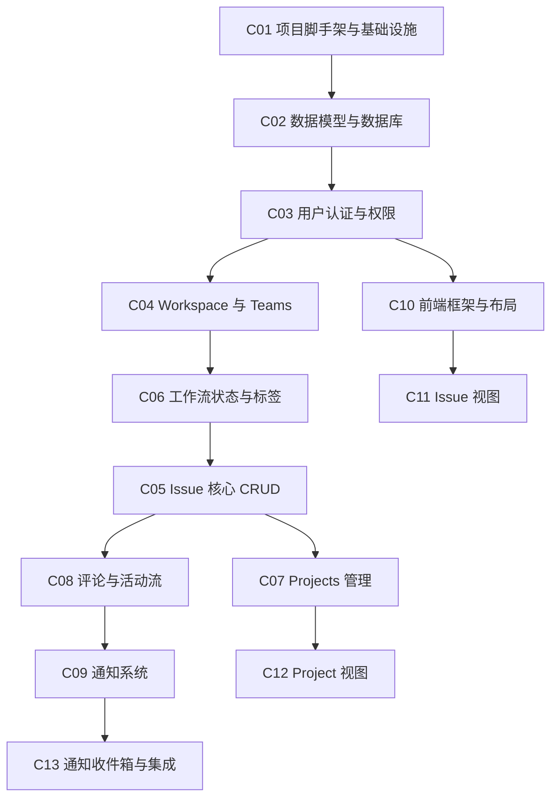

> [!NOTE]
> C05 依赖 C06 是因为 Issue 需要关联 WorkflowState。C06 和 C05 可并行开发（C05 先 mock 状态），但最终集成需要 C06 完成。

### Change 清单

#### C01 — 项目脚手架与基础设施

| 属性   | 内容                   |
| ------ | ---------------------- |
| 目录名 | `c01-project-scaffold` |
| 工作量 | ~3 天                  |
| 依赖   | 无                     |

**范围：**
- Docker Compose 编排（PostgreSQL 16 + Redis 7 + Caddy + MinIO）
- Go 后端项目初始化（Go module、目录结构、Gin 框架）
- React + Vite + TypeScript 前端项目初始化
- shadcn/ui + Zustand 基础配置
- Caddy 反向代理配置（`/api/*` → 后端，`/*` → 前端）
- Makefile / 开发脚本

**对应路线图功能项：** #85 Web App + 基础设施 4 项

---

#### C02 — 数据模型与数据库

| 属性   | 内容                  |
| ------ | --------------------- |
| 目录名 | `c02-database-schema` |
| 工作量 | ~4 天                 |
| 依赖   | C01                   |

**范围：**
- 18 张表 DDL 设计（UUID 主键）
  - **核心业务表（15 张）**：Workspace, Team, User, TeamMember, Issue, IssueRelation, WorkflowState, Project, Milestone, Cycle, Label, Comment, Attachment, Document, Notification
  - **辅助表（3 张）**：`issue_closure`（闭包表）、`issue_status_history`（状态历史）、`workflow_transition`（转换规则）
- `position FLOAT` 字段设计
- 索引设计（Issue 表核心索引）
- 数据库迁移工具集成（golang-migrate 或 GORM AutoMigrate）
- GORM/sqlc 模型定义

**对应路线图功能项：** 数据模型全部 4 项

---

#### C03 — 用户认证与权限

| 属性   | 内容              |
| ------ | ----------------- |
| 目录名 | `c03-auth-system` |
| 工作量 | ~5 天             |
| 依赖   | C02               |

**范围（后端）：**
- 用户注册/登录 API（邮箱+密码，bcrypt）
- JWT 签发与刷新
- 认证中间件
- Admin / Member 角色权限模型
- 权限中间件
- 用户 Profile API（头像上传、邮箱修改、全名/用户名设置）

**范围（前端）：**
- 登录/注册页面 UI
- JWT 存储与自动刷新
- 路由守卫（未登录重定向）
- 用户 Profile 设置页（头像、邮箱、全名、用户名、工作区访问管理）

**对应路线图功能项：** #86, #87, #91

---

#### C04 — Workspace 与 Teams

| 属性   | 内容                  |
| ------ | --------------------- |
| 目录名 | `c04-workspace-teams` |
| 工作量 | ~5 天                 |
| 依赖   | C03                   |

**范围（后端）：**
- Workspace CRUD API + 基本设置
- Teams CRUD API + 成员管理
- 团队标识符（key）用于 Issue ID 生成（如 `ENG-123`）

**范围（前端）：**
- Workspace 设置页面
- Teams 管理页面
- 团队成员管理 UI

**对应路线图功能项：** #88, #89, #90

---

#### C05 — Issue 核心 CRUD

| 属性   | 内容             |
| ------ | ---------------- |
| 目录名 | `c05-issue-crud` |
| 工作量 | ~7 天            |
| 依赖   | C04, C06         |

**范围（后端）：**
- Issue CRUD API
- 状态/优先级/负责人/标签/截止日期/Project 关联
- Issue 自增编号（Team key + 序号）
- 拖拽排序（position 字段更新）
- 订阅/取消订阅

**范围（前端）：**
- Issue 创建模态框（Cmd+C 快捷创建）
- Issue 详情面板（Peek 预览 + 全屏模式）

**对应路线图功能项：** #27~#33, #42

---

#### C06 — 工作流状态与标签

| 属性   | 内容                  |
| ------ | --------------------- |
| 目录名 | `c06-workflow-labels` |
| 工作量 | ~4 天                 |
| 依赖   | C04                   |

**范围（后端）：**
- WorkflowState 表 CRUD（5 种状态类型：backlog/unstarted/started/completed/cancelled）
- 默认工作流初始化（Backlog → Todo → In Progress → In Review → Done → Cancelled）
- Labels CRUD API（工作区级 + 团队级）

**范围（前端）：**
- 状态 SVG 图标体系（虚线圆/半圆/勾选等，对应 5 种状态类型）
- 标签管理 UI

**对应路线图功能项：** #29, #38, #32

---

#### C07 — Projects 管理

| 属性   | 内容           |
| ------ | -------------- |
| 目录名 | `c07-projects` |
| 工作量 | ~5 天          |
| 依赖   | C05            |

**范围（后端）：**
- Projects CRUD API
- 项目状态（Planned/In Progress/Paused/Completed/Cancelled）
- 项目进度自动统计（基于关联 Issue 完成比例）
- 项目负责人（Lead）
- 项目描述（Markdown）

**范围（前端）：**
- Project 列表页
- Project 详情页（进度、Issue 列表、描述）

**对应路线图功能项：** #6~#10

---

#### C08 — 评论与活动流

| 属性   | 内容                    |
| ------ | ----------------------- |
| 目录名 | `c08-comments-activity` |
| 工作量 | ~5 天                   |
| 依赖   | C05                     |

**范围（后端）：**
- 评论 CRUD API
- @mention 解析与关联
- 活动流记录（Issue 状态变更、字段修改、评论等）
- `issue_status_history` 写入逻辑

**范围（前端）：**
- Issue 详情面板中的评论区
- Issue 详情面板中的活动时间线

**对应路线图功能项：** #40, #41

---

#### C09 — 通知系统

| 属性   | 内容                |
| ------ | ------------------- |
| 目录名 | `c09-notifications` |
| 工作量 | ~4 天               |
| 依赖   | C08                 |

**范围（后端）：**
- 通知模型与 API（CRUD、已读/未读标记）
- 通知触发逻辑（被指派、被 @mention、订阅的 Issue 变更）
- 通知配置 API

**范围（前端）：**
- 通知收件箱页面（列表、已读/未读、批量操作）

**对应路线图功能项：** #68, #72

---

#### C10 — 前端框架与布局

| 属性   | 内容                  |
| ------ | --------------------- |
| 目录名 | `c10-frontend-layout` |
| 工作量 | ~5 天                 |
| 依赖   | C03                   |

**范围：**
- 三栏布局组件（左 56px 导航 + 中间自适应 + 右 384px 面板）
- 侧边栏导航（Inbox / My Issues / Projects / Views / Teams 列表）
- 路由系统（React Router）
- 全局状态管理架构（Zustand stores）
- 设计系统基础（颜色 token、间距、动画时长、字体）

**对应路线图功能项：** #65

> [!NOTE]
> 此 change 是前端所有后续 UI change 的基础，仅依赖 C03。与 C04~C09 的后端可并行开发。

---

#### C11 — Issue 视图（列表+看板+过滤）

| 属性   | 内容              |
| ------ | ----------------- |
| 目录名 | `c11-issue-views` |
| 工作量 | ~7 天             |
| 依赖   | C05, C10          |

**范围：**
- Issue 列表视图（表格展示，支持按状态/优先级/负责人/标签分组）
- Issue 看板视图（Kanban Board，拖拽卡片，使用 dnd-kit）
- 基本过滤器（状态/优先级/负责人/标签）
- Display 设置（列显示、分组、排序）
- 列表/看板视图切换

**对应路线图功能项：** #52~#56

---

#### C12 — Project 视图

| 属性   | 内容                |
| ------ | ------------------- |
| 目录名 | `c12-project-views` |
| 工作量 | ~3 天               |
| 依赖   | C07, C10            |

**范围：**
- Project 列表页（卡片/列表展示）
- Project 详情页集成（进度条、状态、关联 Issue 列表）

**对应路线图功能项：** #6（视图部分）

---

#### C13 — 通知收件箱与最终集成

| 属性   | 内容                    |
| ------ | ----------------------- |
| 目录名 | `c13-inbox-integration` |
| 工作量 | ~3 天                   |
| 依赖   | C09, C10                |

**范围：**
- 通知收件箱 UI 集成到三栏布局
- 侧边栏通知计数徽章
- 端到端流程验证与修复

**对应路线图功能项：** #68（UI 部分）

---

### Phase 1 时间线

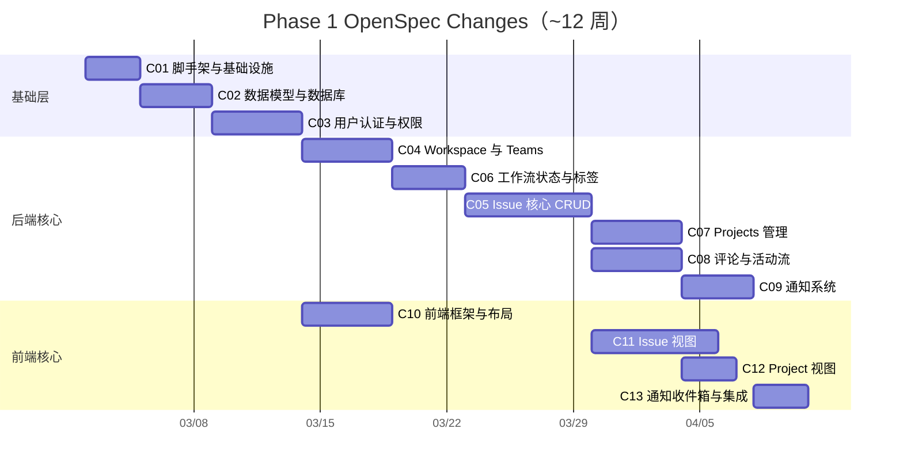

---

## Phase 2 — 迭代管理增强（~2.5 个月，10 个 change）

> **目标**：完善 Issue 体系，支持 Sprint/Cycle 迭代管理，提升操作效率

### 依赖关系

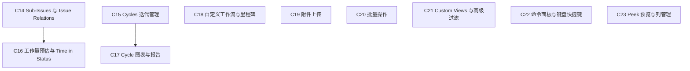

> [!NOTE]
> Phase 2 的 change 大多互相独立，可根据优先级灵活调整顺序。全部依赖 Phase 1 完成。

### Change 清单

#### C14 — Sub-Issues 与 Issue Relations

| 属性   | 内容                       |
| ------ | -------------------------- |
| 目录名 | `c14-sub-issues-relations` |
| 工作量 | ~7 天                      |
| 依赖   | Phase 1 完成               |

**范围：**
- 闭包表 (`issue_closure`) 设计与实现
- **父子 Issue 关系（#36）**：独立的 Issue 实体，通过 `parent_id` 和闭包表关联，支持层级展示和自动联动
- **子任务 TODO 清单（#35）**：内嵌于 Issue 描述中的 Markdown TODO 列表，支持勾选完成（纯前端实现）
- Issue Relations（#37）：Blocked by / Blocking / Related / Duplicate
- 前端：Issue 详情中的子任务列表与关系展示

**对应路线图功能项：** #35, #36, #37

> [!NOTE]
> #35（子任务 TODO 清单）和 #36（父子 Issue 关系）是两种不同的子任务模式：
> - **TODO 清单**：轻量级，内嵌在 Issue 描述中，适合快速拆解小任务
> - **父子 Issue**：重量级，每个子任务是独立 Issue，有独立的状态/负责人，适合需要独立追踪的任务

---

#### C15 — Cycles 迭代管理

| 属性   | 内容         |
| ------ | ------------ |
| 目录名 | `c15-cycles` |
| 工作量 | ~7 天        |
| 依赖   | Phase 1 完成 |

**范围：**
- Cycles 数据模型与 CRUD API
- Cycle 配置（时长、起始日）
- 自动创建（按计划滚动）
- 自动移转（未完成转入下一 Cycle）
- Cooldown 冷却期
- 前端：Cycle 列表、Cycle 详情页、Issue 归入 Cycle

**对应路线图功能项：** #13~#15, #17

---

#### C16 — 工作量预估与 Time in Status

| 属性   | 内容                          |
| ------ | ----------------------------- |
| 目录名 | `c16-estimates-time-tracking` |
| 工作量 | ~4 天                         |
| 依赖   | C14                           |

**范围：**
- Estimates 字段（T-shirt sizing / 数字）
- Time in Status 追踪（基于 `issue_status_history` 表计算）
- 前端：Issue 详情中的预估展示、状态停留时间展示

**对应路线图功能项：** #34, #43

---

#### C17 — Cycle 图表与报告

| 属性   | 内容                |
| ------ | ------------------- |
| 目录名 | `c17-cycle-reports` |
| 工作量 | ~5 天               |
| 依赖   | C15                 |

**范围：**
- Cycle Graph（燃尽图/进度图表）
- Cycle 完成率报告
- 项目进度图表
- 前端：图表组件（使用 recharts 或 Chart.js）

**对应路线图功能项：** #18, #79, #80

---

#### C18 — 自定义工作流与里程碑

| 属性   | 内容                             |
| ------ | -------------------------------- |
| 目录名 | `c18-custom-workflow-milestones` |
| 工作量 | ~5 天                            |
| 依赖   | Phase 1 完成                     |

**范围：**
- 团队自定义状态名称和流转
- 项目里程碑 (Milestones) CRUD
- 拆分项目为多阶段，显示进度百分比
- 跨团队项目支持
- 设置复用（从现有团队复制 workflow 和 cycle 配置）
- 前端：工作流配置 UI、里程碑管理 UI

**对应路线图功能项：** #11, #12, #39, #91

---

#### C19 — 附件上传

| 属性   | 内容              |
| ------ | ----------------- |
| 目录名 | `c19-attachments` |
| 工作量 | ~4 天             |
| 依赖   | Phase 1 完成      |

**范围：**
- MinIO 文件上传 API（presigned URL）
- `Attachment` 表模型（已在 C02 定义，关联 Issue/Comment）
- 图片拖拽上传
- 前端：附件列表、上传组件、图片预览

**对应路线图功能项：** #45

---

#### C20 — 批量操作

| 属性   | 内容                  |
| ------ | --------------------- |
| 目录名 | `c20-bulk-operations` |
| 工作量 | ~4 天                 |
| 依赖   | Phase 1 完成          |

**范围：**
- 批量修改 API（状态/优先级/负责人/标签/Cycle 等）
- 前端：多选模式（Shift/Cmd 选择）
- 批量操作工具栏

**对应路线图功能项：** #44

---

#### C21 — Custom Views 与高级过滤

| 属性   | 内容               |
| ------ | ------------------ |
| 目录名 | `c21-custom-views` |
| 工作量 | ~5 天              |
| 依赖   | Phase 1 完成       |

**范围：**
- 自定义视图保存（过滤/排序/分组条件持久化）
- 视图收藏 (Favorite)
- AND/OR 逻辑多条件组合过滤
- 前端：视图管理 UI、侧边栏 Views 列表

**对应路线图功能项：** #58~#60

---

#### C22 — 命令面板与键盘快捷键

| 属性   | 内容                            |
| ------ | ------------------------------- |
| 目录名 | `c22-command-palette-shortcuts` |
| 工作量 | ~5 天                           |
| 依赖   | Phase 1 完成                    |

**范围：**
- Cmd+K 命令面板（模糊搜索 + 分组命令）
- **全局搜索**：Issue / Project / Team / User 快速查找（基于 PostgreSQL 全文搜索）
- 全局快捷键系统
- Issue 快捷键（C/E/A/L/P/S/Y）
- 列表视图快捷键（J/K 导航、X 选中、F 过滤）
- 时区设置

**对应路线图功能项：** #63, #64, #92

> [!NOTE]
> 全局搜索在 MVP 阶段使用 PostgreSQL 全文搜索（`tsvector` + GIN 索引）即可满足需求。如需更高级的搜索（如模糊匹配、拼音搜索、权重排序），可在后续 Phase 集成 Elasticsearch 或 Meilisearch。

---

#### C23 — Peek 预览与列管理

| 属性   | 内容               |
| ------ | ------------------ |
| 目录名 | `c23-peek-columns` |
| 工作量 | ~3 天              |
| 依赖   | Phase 1 完成       |

**范围：**
- Peek 预览面板（选中 Issue 右侧弹出预览）
- Hidden columns 管理（看板视图列显示/隐藏）
- Team Owner 角色

**对应路线图功能项：** #57, #61, #93

---

### Phase 2 时间线

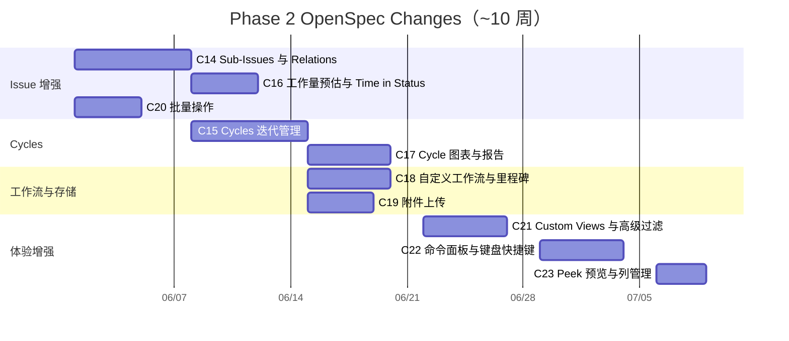

---

## Phase 3 — 协作与集成（~2.5 个月，9 个 change）

> **目标**：外部系统集成、文档协作、API 开放

### 依赖关系

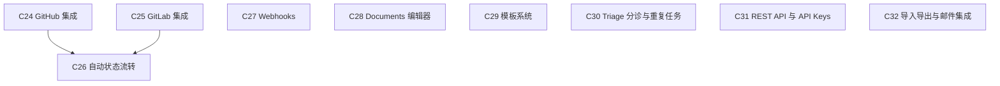

### Change 清单

#### C24 — GitHub 集成

| 属性   | 内容                     |
| ------ | ------------------------ |
| 目录名 | `c24-github-integration` |
| 工作量 | ~7 天                    |
| 依赖   | Phase 2 完成             |

**范围：**
- GitHub App / OAuth 集成
- PR/Commit 关联 Issue（Commit Message 解析：`ENG-123` / `fixes ENG-123`）
- GitHub Webhook 接收
- 前端：GitHub 连接设置、Issue 详情中的 PR 列表

**对应路线图功能项：** #49

---

#### C25 — GitLab 集成

| 属性   | 内容                     |
| ------ | ------------------------ |
| 目录名 | `c25-gitlab-integration` |
| 工作量 | ~5 天                    |
| 依赖   | Phase 2 完成             |

**范围：**
- GitLab OAuth + Webhook 集成
- MR 关联 Issue
- 前端：GitLab 连接设置

**对应路线图功能项：** #50

---

#### C26 — 自动状态流转（Git 集成）

| 属性   | 内容                         |
| ------ | ---------------------------- |
| 目录名 | `c26-auto-status-transition` |
| 工作量 | ~3 天                        |
| 依赖   | C24 或 C25                   |

**范围：**
- PR 创建 → In Review 自动流转
- PR 合并 → Done 自动流转
- Commit Message 中 `fixes` 关键字自动关闭 Issue

**对应路线图功能项：** #51

---

#### C27 — Webhooks

| 属性   | 内容           |
| ------ | -------------- |
| 目录名 | `c27-webhooks` |
| 工作量 | ~5 天          |
| 依赖   | Phase 2 完成   |

**范围：**
- Webhooks CRUD API
- 30+ 事件类型定义（Issue/Project/Cycle/Comment 等）
- Webhook 投递引擎（重试、签名验证）
- 投递日志
- 前端：Webhook 管理 UI

**对应路线图功能项：** #99

---

#### C28 — Documents 编辑器

| 属性   | 内容            |
| ------ | --------------- |
| 目录名 | `c28-documents` |
| 工作量 | ~7 天           |
| 依赖   | Phase 2 完成    |

**范围：**
- Documents 数据模型与 CRUD API
- Markdown 富文本编辑器（Tiptap 或 Milkdown）
- Mermaid diagrams 渲染
- @mention 支持（Issue/Project 引用）
- 前端：Documents 列表、编辑器页面

**对应路线图功能项：** #73, #74, #76

---

#### C29 — 模板系统

| 属性   | 内容            |
| ------ | --------------- |
| 目录名 | `c29-templates` |
| 工作量 | ~5 天           |
| 依赖   | C28             |

**范围：**
- Issue 模板 CRUD
- Project 模板（预定义 Issues 快速创建）
- Form Templates（表单模板，标准化 Issue 收集字段）
- Document 模板（Spec/PRD）
- 前端：模板管理 UI、创建时选择模板

**对应路线图功能项：** #4, #19, #46, #75

---

#### C30 — Triage 分诊与重复任务

| 属性   | 内容                   |
| ------ | ---------------------- |
| 目录名 | `c30-triage-recurring` |
| 工作量 | ~5 天                  |
| 依赖   | Phase 2 完成           |

**范围：**
- Triage 分诊收件箱（新 Issue 先进入审核队列）
- Triage 操作（Accept → 分配团队 → 移入 Backlog / Decline）
- 重复任务（按计划自动创建 Recurring Issues）
- 前端：Triage 队列 UI

**对应路线图功能项：** #2, #3, #48

---

#### C31 — REST API 与 API Keys

| 属性   | 内容             |
| ------ | ---------------- |
| 目录名 | `c31-public-api` |
| 工作量 | ~5 天            |
| 依赖   | Phase 2 完成     |

**范围：**
- REST API 完整开放（规范化端点、分页、过滤）
- API Keys 管理（个人密钥、权限范围）
- API 文档（Swagger/OpenAPI）
- 前端：API Keys 管理 UI

**对应路线图功能项：** #97, #98

---

#### C32 — 导入导出与邮件集成

| 属性   | 内容                      |
| ------ | ------------------------- |
| 目录名 | `c32-import-export-email` |
| 工作量 | ~5 天                     |
| 依赖   | Phase 2 完成              |

**范围：**
- 导入功能（Jira JSON / CSV 解析与映射）
- 导出功能（CSV / JSON）
- 邮件通知（未读汇总邮件）
- 邮件创建 Issue（接收邮件解析为 Issue）

**对应路线图功能项：** #1, #70, #96

---

### Phase 3 时间线

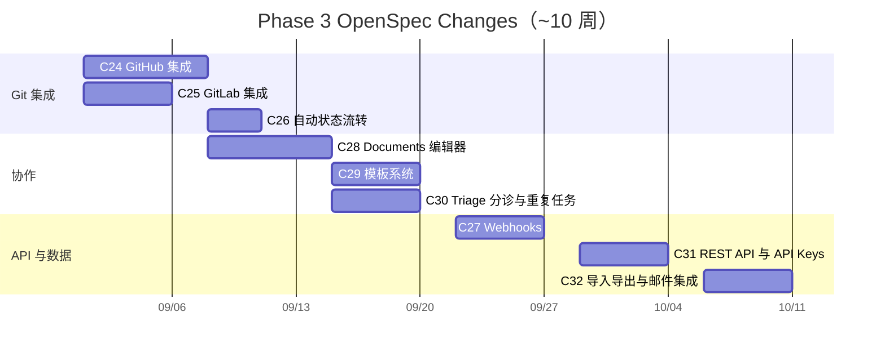

---

## Phase 4 — 高级功能（~2.5 个月，7 个 change）

> **目标**：战略规划、数据分析、IM 通知集成、企业级功能

### 依赖关系

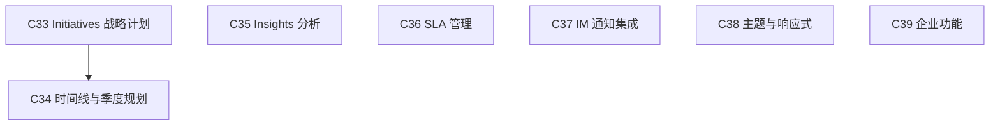

### Change 清单

#### C33 — Initiatives 战略计划

| 属性   | 内容              |
| ------ | ----------------- |
| 目录名 | `c33-initiatives` |
| 工作量 | ~7 天             |
| 依赖   | Phase 3 完成      |

**范围：**
- Initiatives 数据模型与 CRUD API
- Sub-initiatives（嵌套子计划）
- 项目依赖关系可视化
- 项目更新通报（Latest update + Updates 标签页）
- 里程碑转项目功能
- 前端：Initiatives 列表、详情页、依赖关系图

**对应路线图功能项：** #20~#24

---

#### C34 — 时间线与季度规划

| 属性   | 内容                    |
| ------ | ----------------------- |
| 目录名 | `c34-timeline-planning` |
| 工作量 | ~7 天                   |
| 依赖   | C33                     |

**范围：**
- 时间线视图（多 Project 甘特图）
- 季度规划视图（Q1-Q4 组织）
- Cycle Documents 支持
- 前端：甘特图组件、季度视图

**对应路线图功能项：** #16, #22, #25, #26, #62

---

#### C35 — Insights 分析

| 属性   | 内容           |
| ------ | -------------- |
| 目录名 | `c35-insights` |
| 工作量 | ~5 天          |
| 依赖   | Phase 3 完成   |

**范围：**
- Insights 分析引擎（燃尽图 / Cycle 报告增强）
- 团队指标（速率/吞吐量/平均完成时间）
- 前端：Insights 页面、多种图表

**对应路线图功能项：** #81

---

#### C36 — SLA 管理

| 属性   | 内容         |
| ------ | ------------ |
| 目录名 | `c36-sla`    |
| 工作量 | ~5 天        |
| 依赖   | Phase 3 完成 |

**范围：**
- SLA 规则模型与 CRUD API
- 基于规则自动应用时限
- SLA 达标率统计报告
- SLA 火焰图标（紧急程度可视化）
- 前端：SLA 配置 UI、违约警示

**对应路线图功能项：** #47, #82, #83

---

#### C37 — IM 通知集成

| 属性   | 内容                   |
| ------ | ---------------------- |
| 目录名 | `c37-im-notifications` |
| 工作量 | ~7 天                  |
| 依赖   | Phase 3 完成           |

**范围：**
- 企微通知集成（企业微信 API）
- 钉钉通知集成（钉钉机器人 API）
- 飞书通知集成（飞书机器人 API）
- 桌面/移动推送通知
- 前端：IM 通知配置 UI

**对应路线图功能项：** #69, #71

---

#### C38 — 主题与响应式

| 属性   | 内容                   |
| ------ | ---------------------- |
| 目录名 | `c38-theme-responsive` |
| 工作量 | ~5 天                  |
| 依赖   | Phase 3 完成           |

**范围：**
- 深色/浅色主题（CSS 变量切换）
- 响应式移动端（< 640px 单栏 / 640-1024px 双栏 / > 1024px 三栏）
- Workspace Owner 角色（工作区最高权限）

**对应路线图功能项：** #66, #67, #102

> [!NOTE]
> Team Owner 角色已在 C23（Phase 2）中实现。本 change 仅增加 Workspace Owner 角色。

---

#### C39 — 企业功能

| 属性   | 内容             |
| ------ | ---------------- |
| 目录名 | `c39-enterprise` |
| 工作量 | ~7 天            |
| 依赖   | Phase 3 完成     |

**范围：**
- SSO/LDAP 集成（SAML/SCIM）
- 审计日志（append-only，操作记录）
- 前端：SSO 配置 UI、审计日志查看器

**对应路线图功能项：** #100, #101

---

### Phase 4 时间线

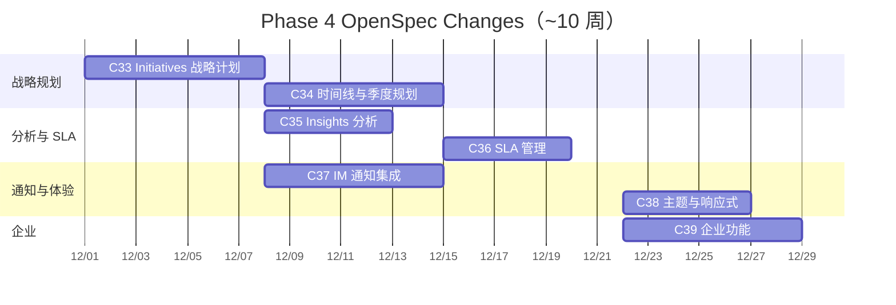

---

## Phase 5 — 持续演进（~6 个月，3 个 change）

> **目标**：本地优先架构、实时协同、桌面客户端

### 依赖关系

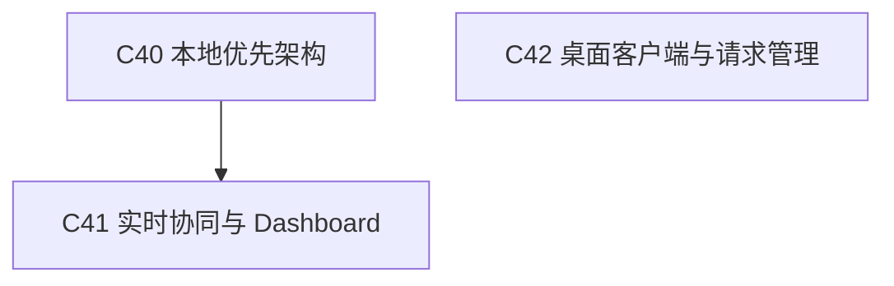

### Change 清单

#### C40 — 本地优先架构

| 属性   | 内容              |
| ------ | ----------------- |
| 目录名 | `c40-local-first` |
| 工作量 | ~6 周             |
| 依赖   | Phase 4 完成      |

**范围：**
- IndexedDB 本地存储层
- WebSocket 增量同步协议
- 冲突解决策略（Last-Write-Wins + 字段级合并）
- 离线模式支持
- Zustand + IndexedDB 持久化
- 前端：离线指示器、同步状态展示

**对应路线图功能项：** 本地优先架构、冲突解决策略

> [!IMPORTANT]
> 这是架构级重构，影响面广，建议内部进一步拆分为 sub-change（如 IndexedDB 层、同步协议、冲突解决分别独立），执行时根据实际情况再细化。

---

#### C41 — 实时协同与 Dashboard

| 属性   | 内容                     |
| ------ | ------------------------ |
| 目录名 | `c41-realtime-dashboard` |
| 工作量 | ~6 周                    |
| 依赖   | C40                      |

**范围：**
- 实时协同编辑（CRDT/Yjs 集成）
- Dashboard 自定义仪表盘
- Pulse 更新流（个性化/热门/最新更新流）
- 前端：协同编辑光标、Dashboard 编辑器

**对应路线图功能项：** #77, #78, #84

---

#### C42 — 桌面客户端与请求管理

| 属性   | 内容               |
| ------ | ------------------ |
| 目录名 | `c42-desktop-asks` |
| 工作量 | ~6 周              |
| 依赖   | Phase 4 完成       |

**范围：**
- Tauri 桌面客户端
- Guest 权限 + 私有团队
- Linear Asks（从 IM 频道收集请求：企微/钉钉/飞书）
- 前端：Tauri 适配、Guest 视图、Asks 管理

**对应路线图功能项：** #5, #94, #95, #103

---

### Phase 5 时间线

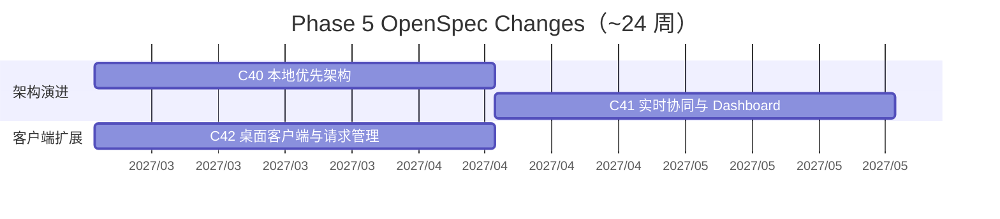

---

## 全局总览

### 统计

| 阶段     | 目标         | Change 数 |    预估时长    | 功能项数 |
| -------- | ------------ | :-------: | :------------: | :------: |
| Phase 1  | MVP 核心     |    13     |    ~3 个月     |    32    |
| Phase 2  | 迭代管理增强 |    10     |   ~2.5 个月    |    26    |
| Phase 3  | 协作与集成   |     9     |   ~2.5 个月    |    19    |
| Phase 4  | 高级功能     |     7     |   ~2.5 个月    |    19    |
| Phase 5  | 持续演进     |     3     |    ~6 个月     |    8     |
| **总计** |              |  **42**   | **~16.5 个月** | **104**  |

### 全局依赖链

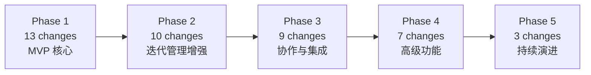

### 里程碑时间线

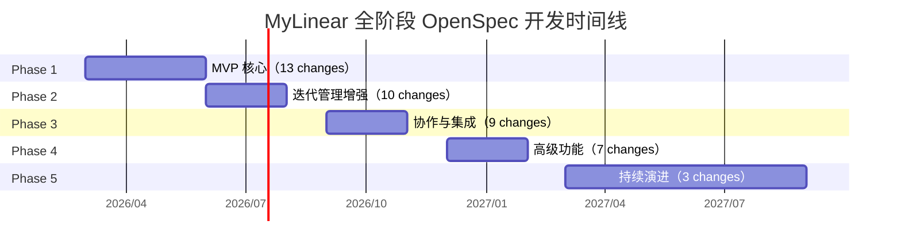

---

> **文档版本**：v1.5
> **最后更新**：2026年2月17日
> **Change 总计**：42 个（覆盖路线图全部 104 项功能）
>
> **修订记录**：
> - v1.5 (2026-02-17)：更新 C06 工作流状态与标签已完成
> - v1.4 (2026-02-17)：更新 C04 Workspace 与 Teams 已完成
> - v1.3 (2026-02-16)：新增全局进度追踪表格（5 阶段 42 个 change），记录 C01/C02/C03 已完成
> - v1.2 (2026-02-15)：新增 Profile 功能到 C03（头像、邮箱、全名、用户名管理），更新功能项编号和统计
> - v1.1 (2026-02-15)：明确 C02 表数量（15→18 张）、修正 C05 依赖关系、明确 #35/#36 区分、补充全局搜索到 C22、补充 Attachment 表说明
> - v1.0 (2026-02-15)：初始版本
