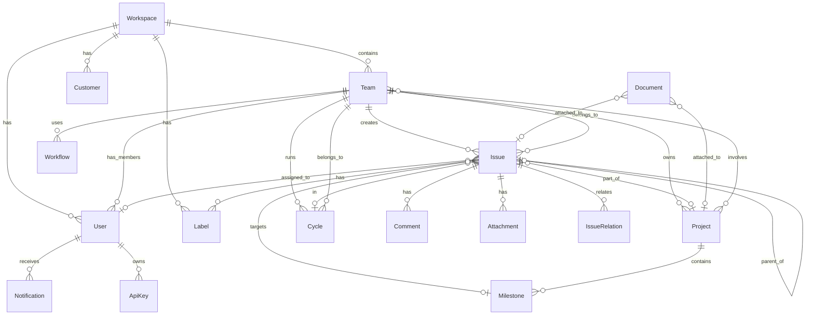

## 五、数据模型设计

### 5.1 核心实体关系图



### 5.2 核心表结构

#### 5.2.1 Workspace（工作区）

| 字段 | 类型 | 约束 | 说明 |
|------|------|------|------|
| id | UUID | PK | 主键 |
| name | VARCHAR(255) | NOT NULL | 工作区名称 |
| slug | VARCHAR(50) | UNIQUE | URL 标识 |
| logo_url | TEXT | | Logo URL |
| settings | JSONB | | 工作区配置 |
| created_at | TIMESTAMPTZ | NOT NULL | 创建时间 |
| updated_at | TIMESTAMPTZ | NOT NULL | 更新时间 |

#### 5.2.2 Team（团队）

| 字段 | 类型 | 约束 | 说明 |
|------|------|------|------|
| id | UUID | PK | 主键 |
| workspace_id | UUID | FK → Workspace | 所属工作区 |
| parent_id | UUID | FK → Team (nullable) | 父团队（嵌套） |
| name | VARCHAR(255) | NOT NULL | 团队名称 |
| key | VARCHAR(10) | NOT NULL, UNIQUE | 团队标识符（如 ENG） |
| icon_url | TEXT | | 团队图标 |
| timezone | VARCHAR(50) | DEFAULT 'UTC' | 时区 |
| is_private | BOOLEAN | DEFAULT FALSE | 是否私有团队 |
| cycle_settings | JSONB | | Cycle 配置 |
| workflow_settings | JSONB | | 工作流配置 |
| created_at | TIMESTAMPTZ | NOT NULL | 创建时间 |
| updated_at | TIMESTAMPTZ | NOT NULL | 更新时间 |

**索引**：
- `idx_team_workspace_id` ON (workspace_id)
- `idx_team_parent_id` ON (parent_id)
- `UNIQUE (workspace_id, key)`

#### 5.2.3 User（用户）

| 字段 | 类型 | 约束 | 说明 |
|------|------|------|------|
| id | UUID | PK | 主键 |
| workspace_id | UUID | FK → Workspace | 所属工作区 |
| email | VARCHAR(255) | NOT NULL, UNIQUE | 邮箱 |
| name | VARCHAR(255) | NOT NULL | 显示名称 |
| avatar_url | TEXT | | 头像 URL |
| role | ENUM | NOT NULL | global_admin / admin / member / guest |
| settings | JSONB | | 用户偏好设置 |
| created_at | TIMESTAMPTZ | NOT NULL | 创建时间 |
| updated_at | TIMESTAMPTZ | NOT NULL | 更新时间 |

#### 5.2.4 TeamMember（团队成员）

| 字段 | 类型 | 约束 | 说明 |
|------|------|------|------|
| team_id | UUID | PK, FK → Team | 团队 ID |
| user_id | UUID | PK, FK → User | 用户 ID |
| role | ENUM | NOT NULL | owner / member |
| joined_at | TIMESTAMPTZ | NOT NULL | 加入时间 |

#### 5.2.5 Issue（工单）

| 字段 | 类型 | 约束 | 说明 |
|------|------|------|------|
| id | UUID | PK | 主键 |
| team_id | UUID | FK → Team, NOT NULL | 所属团队 |
| number | INTEGER | NOT NULL | 团队内序号（如 ENG-123） |
| title | VARCHAR(500) | NOT NULL | 标题 |
| description | TEXT | | Markdown 描述 |
| status_id | UUID | FK → WorkflowState | 当前状态 |
| priority | INTEGER | DEFAULT 0 | 0=None, 1=Urgent, 2=High, 3=Medium, 4=Low |
| assignee_id | UUID | FK → User (nullable) | 负责人 |
| project_id | UUID | FK → Project (nullable) | 关联项目 |
| milestone_id | UUID | FK → Milestone (nullable) | 关联里程碑 |
| cycle_id | UUID | FK → Cycle (nullable) | 归入 Cycle |
| parent_id | UUID | FK → Issue (nullable) | 父 Issue |
| estimate | INTEGER | (nullable) | 工作量预估（点数） |
| due_date | DATE | (nullable) | 截止日期 |
| sla_due_at | TIMESTAMPTZ | (nullable) | SLA 截止时间 |
| labels | UUID[] | | 标签 ID 数组 |
| created_by_id | UUID | FK → User | 创建者 |
| created_at | TIMESTAMPTZ | NOT NULL | 创建时间 |
| updated_at | TIMESTAMPTZ | NOT NULL | 更新时间 |
| completed_at | TIMESTAMPTZ | (nullable) | 完成时间 |
| cancelled_at | TIMESTAMPTZ | (nullable) | 取消时间 |

**索引**：
- `UNIQUE (team_id, number)`
- `idx_issue_assignee_id` ON (assignee_id)
- `idx_issue_project_id` ON (project_id)
- `idx_issue_cycle_id` ON (cycle_id)
- `idx_issue_status_id` ON (status_id)
- `idx_issue_parent_id` ON (parent_id)
- `GIN (labels)` for array operations

#### 5.2.6 IssueRelation（Issue 关系）

| 字段 | 类型 | 约束 | 说明 |
|------|------|------|------|
| id | UUID | PK | 主键 |
| issue_id | UUID | FK → Issue, NOT NULL | 源 Issue |
| related_issue_id | UUID | FK → Issue, NOT NULL | 目标 Issue |
| type | ENUM | NOT NULL | blocked_by / blocking / related / duplicate |
| created_at | TIMESTAMPTZ | NOT NULL | 创建时间 |

**索引**：
- `UNIQUE (issue_id, related_issue_id, type)`
- `idx_issue_relation_related` ON (related_issue_id)

#### 5.2.7 WorkflowState（工作流状态）

| 字段 | 类型 | 约束 | 说明 |
|------|------|------|------|
| id | UUID | PK | 主键 |
| team_id | UUID | FK → Team, NOT NULL | 所属团队 |
| name | VARCHAR(100) | NOT NULL | 状态名称 |
| type | ENUM | NOT NULL | backlog / unstarted / started / completed / cancelled |
| color | VARCHAR(20) | | 颜色代码 |
| position | FLOAT | NOT NULL | 排序位置 |
| is_default | BOOLEAN | DEFAULT FALSE | 是否默认状态 |
| created_at | TIMESTAMPTZ | NOT NULL | 创建时间 |

#### 5.2.8 Project（项目）

| 字段 | 类型 | 约束 | 说明 |
|------|------|------|------|
| id | UUID | PK | 主键 |
| workspace_id | UUID | FK → Workspace | 所属工作区 |
| name | VARCHAR(255) | NOT NULL | 项目名称 |
| description | TEXT | | Markdown 描述 |
| status | ENUM | NOT NULL | planned / in_progress / paused / completed / cancelled |
| priority | INTEGER | DEFAULT 0 | 优先级 |
| lead_id | UUID | FK → User (nullable) | 项目负责人 |
| start_date | DATE | (nullable) | 开始日期 |
| target_date | DATE | (nullable) | 目标日期 |
| teams | UUID[] | | 关联团队 ID |
| labels | UUID[] | | 标签 ID |
| created_at | TIMESTAMPTZ | NOT NULL | 创建时间 |
| updated_at | TIMESTAMPTZ | NOT NULL | 更新时间 |
| completed_at | TIMESTAMPTZ | (nullable) | 完成时间 |

#### 5.2.9 Milestone（里程碑）

| 字段 | 类型 | 约束 | 说明 |
|------|------|------|------|
| id | UUID | PK | 主键 |
| project_id | UUID | FK → Project, NOT NULL | 所属项目 |
| name | VARCHAR(255) | NOT NULL | 里程碑名称 |
| description | TEXT | | 描述 |
| target_date | DATE | (nullable) | 目标日期 |
| position | FLOAT | NOT NULL | 排序位置 |
| created_at | TIMESTAMPTZ | NOT NULL | 创建时间 |

#### 5.2.10 Cycle（迭代）

| 字段 | 类型 | 约束 | 说明 |
|------|------|------|------|
| id | UUID | PK | 主键 |
| team_id | UUID | FK → Team, NOT NULL | 所属团队 |
| number | INTEGER | NOT NULL | 迭代序号 |
| name | VARCHAR(255) | | 迭代名称 |
| description | TEXT | | 描述 |
| start_date | DATE | NOT NULL | 开始日期 |
| end_date | DATE | NOT NULL | 结束日期 |
| cooldown_end_date | DATE | (nullable) | 冷却期结束日期 |
| status | ENUM | NOT NULL | upcoming / active / completed |
| created_at | TIMESTAMPTZ | NOT NULL | 创建时间 |

**索引**：
- `UNIQUE (team_id, number)`

#### 5.2.11 Label（标签）

| 字段 | 类型 | 约束 | 说明 |
|------|------|------|------|
| id | UUID | PK | 主键 |
| workspace_id | UUID | FK → Workspace | 工作区级标签 |
| team_id | UUID | FK → Team (nullable) | 团队级标签 |
| name | VARCHAR(100) | NOT NULL | 标签名称 |
| description | TEXT | | 标签描述 |
| color | VARCHAR(20) | NOT NULL | 颜色代码 |
| parent_id | UUID | FK → Label (nullable) | 父标签（标签组） |
| is_archived | BOOLEAN | DEFAULT FALSE | 是否归档 |
| created_at | TIMESTAMPTZ | NOT NULL | 创建时间 |

#### 5.2.12 Comment（评论）

| 字段 | 类型 | 约束 | 说明 |
|------|------|------|------|
| id | UUID | PK | 主键 |
| issue_id | UUID | FK → Issue, NOT NULL | 所属 Issue |
| parent_id | UUID | FK → Comment (nullable) | 父评论（嵌套回复） |
| user_id | UUID | FK → User, NOT NULL | 评论者 |
| body | TEXT | NOT NULL | Markdown 内容 |
| created_at | TIMESTAMPTZ | NOT NULL | 创建时间 |
| updated_at | TIMESTAMPTZ | NOT NULL | 更新时间 |
| edited_at | TIMESTAMPTZ | (nullable) | 编辑时间 |

#### 5.2.13 Attachment（附件）

| 字段 | 类型 | 约束 | 说明 |
|------|------|------|------|
| id | UUID | PK | 主键 |
| issue_id | UUID | FK → Issue, NOT NULL | 所属 Issue |
| user_id | UUID | FK → User, NOT NULL | 上传者 |
| filename | VARCHAR(255) | NOT NULL | 文件名 |
| url | TEXT | NOT NULL | 文件 URL |
| size | BIGINT | | 文件大小（字节） |
| mime_type | VARCHAR(100) | | MIME 类型 |
| created_at | TIMESTAMPTZ | NOT NULL | 上传时间 |

#### 5.2.14 Document（文档）

| 字段 | 类型 | 约束 | 说明 |
|------|------|------|------|
| id | UUID | PK | 主键 |
| workspace_id | UUID | FK → Workspace | 所属工作区 |
| project_id | UUID | FK → Project (nullable) | 关联项目 |
| issue_id | UUID | FK → Issue (nullable) | 关联 Issue |
| title | VARCHAR(500) | NOT NULL | 标题 |
| content | TEXT | NOT NULL | Markdown 内容 |
| icon | VARCHAR(10) | | 文档图标 |
| created_by_id | UUID | FK → User | 创建者 |
| created_at | TIMESTAMPTZ | NOT NULL | 创建时间 |
| updated_at | TIMESTAMPTZ | NOT NULL | 更新时间 |

#### 5.2.15 Notification（通知）

| 字段 | 类型 | 约束 | 说明 |
|------|------|------|------|
| id | UUID | PK | 主键 |
| user_id | UUID | FK → User, NOT NULL | 接收者 |
| type | ENUM | NOT NULL | 通知类型 |
| title | VARCHAR(255) | NOT NULL | 标题 |
| body | TEXT | | 内容 |
| resource_type | VARCHAR(50) | | 关联资源类型 |
| resource_id | UUID | | 关联资源 ID |
| read_at | TIMESTAMPTZ | (nullable) | 已读时间 |
| created_at | TIMESTAMPTZ | NOT NULL | 创建时间 |

### 5.3 Issue Sub-Issue 树形存储方案

使用 **闭包表（Closure Table）** 存储层级关系：

```sql
-- Issue 层级闭包表
CREATE TABLE issue_closure (
    ancestor_id UUID NOT NULL REFERENCES issue(id) ON DELETE CASCADE,
    descendant_id UUID NOT NULL REFERENCES issue(id) ON DELETE CASCADE,
    depth INTEGER NOT NULL,
    PRIMARY KEY (ancestor_id, descendant_id)
);

-- 索引
CREATE INDEX idx_issue_closure_descendant ON issue_closure(descendant_id);
CREATE INDEX idx_issue_closure_depth ON issue_closure(depth);
```

**查询示例**：
```sql
-- 获取某 Issue 的所有子孙 Issue
SELECT i.* FROM issue i
JOIN issue_closure c ON i.id = c.descendant_id
WHERE c.ancestor_id = :issue_id;

-- 获取某 Issue 的直接子 Issue
SELECT i.* FROM issue i
JOIN issue_closure c ON i.id = c.descendant_id
WHERE c.ancestor_id = :issue_id AND c.depth = 1;
```

### 5.4 Issue 关系多态存储

```sql
-- Issue 关系表（支持多种关系类型）
CREATE TABLE issue_relation (
    id UUID PRIMARY KEY DEFAULT gen_random_uuid(),
    issue_id UUID NOT NULL REFERENCES issue(id) ON DELETE CASCADE,
    related_issue_id UUID NOT NULL REFERENCES issue(id) ON DELETE CASCADE,
    type VARCHAR(20) NOT NULL CHECK (type IN ('blocked_by', 'blocking', 'related', 'duplicate')),
    created_at TIMESTAMPTZ NOT NULL DEFAULT NOW(),
    UNIQUE (issue_id, related_issue_id, type)
);
```

---

### 5.5 数据模型设计原则分析

15 张核心表的设计体现了以下架构原则：

| 设计决策 | 原因 | 备注 |
|---------|------|------|
| UUID 主键 | 支持分布式 ID 生成，兼容 Local-First 架构 | 客户端也能生成 ID，无需服务端分配 |
| `JSONB` 存储配置 | 工作区/团队的灵活设置无需频繁改表 | `settings`/`cycle_settings`/`workflow_settings` 均用 JSONB |
| 闭包表（Closure Table） | Sub-Issue 树形查询高效 | `issue_closure` 表支持任意深度子任务查询 |
| `FLOAT` 排序位置 | 拖拽排序不需要全量更新 | `position` 字段用小数实现插入排序 |
| `labels UUID[]` 数组 | 多标签关联避免中间表 | PostgreSQL GIN 索引支持数组查询 |
| 多级标签层级 | `parent_id` 实现标签组嵌套 | 支持工作区级 + 团队级标签体系 |
| 时间戳精确记录 | `completed_at`/`cancelled_at` 独立字段 | 支持 Time in Status 和 SLA 计算 |

**关键索引设计**：

Issue 表是系统核心，索引设计直接决定查询性能：

- `UNIQUE (team_id, number)` — Issue 标识符唯一性
- `idx_issue_assignee_id` — 按负责人查询
- `idx_issue_project_id` — 按项目查询
- `idx_issue_cycle_id` — 按迭代查询
- `idx_issue_status_id` — 按状态查询
- `idx_issue_parent_id` — 子 Issue 查询
- `GIN (labels)` — 标签数组查询

---
