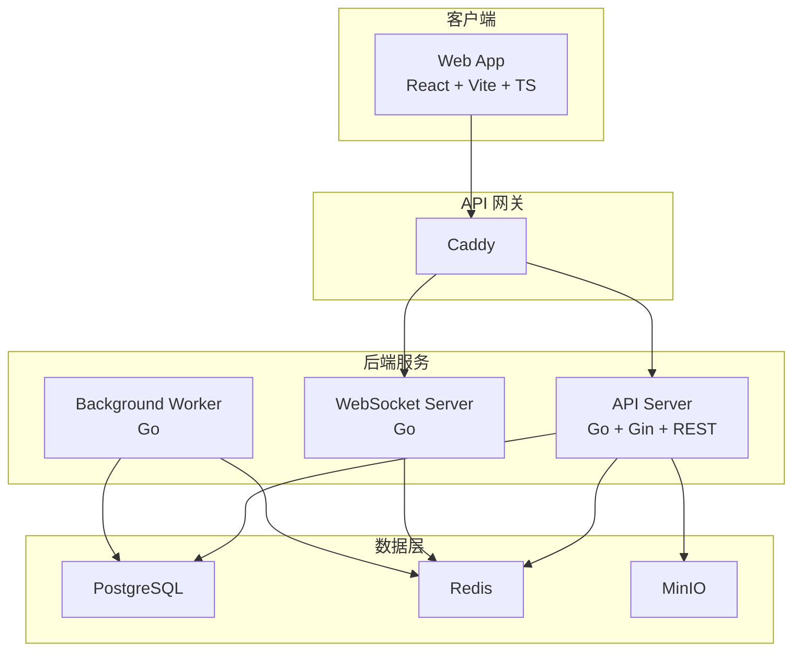
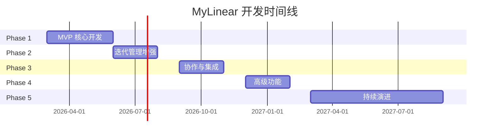

# MyLinear 产品路线图

## 产品定位

| 属性 | 决策 |
|------|------|
| 竞品对标 | [Linear](https://linear.app) |
| 使用场景 | 公司内部软件项目管理，可能开源 |
| 许可证 | MIT |
| 部署方式 | 私有部署（Docker Compose） |
| 国内适配 | 企微/钉钉/飞书替代 Slack |
| AI 功能 | 暂不考虑 |

---

## 一、技术栈

| 层级 | 选型 | 理由 |
|------|------|------|
| 前端 | React + Vite + TypeScript | 生态最成熟，AI 编码辅助好，Linear 自身也用 React |
| UI 组件库 | shadcn/ui (Radix UI) | 风格贴近 Linear 的现代极简 UI |
| 状态管理 | Zustand | 轻量简洁 |
| 后端 | Go + Gin | 高性能，适合私有部署，资源占用低 |
| API | REST（初期）| 比 GraphQL 更简单，MVP 阶段够用 |
| ORM | GORM 或 sqlc | Go 生态主流 |
| 实时通信 | gorilla/websocket | 通知推送、状态同步 |
| 数据库 | PostgreSQL 16 | 与 Linear 一致，功能强大 |
| 缓存 | Redis 7 | 会话、通知队列、缓存 |
| 文件存储 | MinIO (S3 兼容) | 附件、图片 |
| 反向代理 | Caddy | HTTPS、路由 |
| 部署 | Docker Compose | 一键私有部署 |

### 架构总览

> [!IMPORTANT]
> MVP 阶段采用传统 API 调用模式，本地优先架构作为长期演进方向（Phase 5）。

---

## 二、功能规划

### 功能优先级标注

| 标记 | 说明 |
|------|------|
| ✅ | Phase 1 MVP |
| 🔵 | Phase 2 |
| 🟡 | Phase 3 |
| 🟠 | Phase 4 |
| 🔴 | Phase 5 |

---

### 2.1 Intake（需求收集）

| # | 功能 | 优先级 | 说明 |
|---|------|:------:|------|
| 1 | 邮件创建 Issue | 🟡 | 通过邮件直接创建 Issue |
| 2 | Triage 分诊收件箱 | 🟡 | 新 Issue 先进入审核队列 |
| 3 | Triage 操作（Accept/Decline） | 🟡 | 审查 → 分配团队 → 移入 Backlog 或拒绝 |
| 4 | Form Templates（表单模板） | 🟡 | 标准化 Issue 收集的表单字段 |
| 5 | Linear Asks（请求管理） | 🔴 | 从 IM 频道收集请求（企微/钉钉/飞书） |

---

### 2.2 Plan（规划）

| # | 功能 | 优先级 | 说明 |
|---|------|:------:|------|
| 6 | Projects CRUD | ✅ | 创建/编辑/归档项目 |
| 7 | 项目状态 | ✅ | Planned/In Progress/Paused/Completed/Cancelled |
| 8 | 项目描述 | ✅ | 富文本编辑（Markdown） |
| 9 | 项目负责人（Lead） | ✅ | 指定项目负责人 |
| 10 | 项目进度跟踪 | ✅ | 自动统计完成度 |
| 11 | 跨团队项目 | 🔵 | 多团队 Issues 归入同一 Project |
| 12 | 里程碑（Milestones） | 🔵 | 拆分项目为多阶段，显示进度百分比 |
| 13 | Cycles 配置 | 🔵 | 时长、起始日配置 |
| 14 | Cycles 自动创建 | 🔵 | 按计划滚动创建 |
| 15 | Cycles 自动移转 | 🔵 | 未完成转入下一 Cycle |
| 16 | Cycles Documents | 🟠 | Cycle 支持 Documents 和 Links |
| 17 | Cooldown 冷却期 | 🔵 | Cycle 之间设置间隔缓冲 |
| 18 | Cycle Graph（进度图表） | 🔵 | 自动生成燃尽图 |
| 19 | 项目模板 | 🟡 | 预定义 Issues 快速创建 |
| 20 | 项目更新通报 | 🟠 | Latest update + Updates 标签页 |
| 21 | 项目依赖 | 🟠 | 可视化项目间依赖关系 |
| 22 | 里程碑转项目 | 🟠 | Milestone → Project 转换 |
| 23 | Initiatives（战略计划） | 🟠 | 组织级别的战略目标和路线图 |
| 24 | Sub-initiatives | 🟠 | 嵌套子计划 |
| 25 | 时间线视图（甘特图） | 🟠 | 多 Project 甘特图 |
| 26 | 季度规划 | 🟠 | 按 Q1-Q4 组织 |

---

### 2.3 Build（构建）

| # | 功能 | 优先级 | 说明 |
|---|------|:------:|------|
| 27 | Issue CRUD | ✅ | 创建/编辑/删除/归档 Issue |
| 28 | Issue 标题和描述 | ✅ | Markdown 描述 |
| 29 | Issue 状态 | ✅ | Backlog/Todo/In Progress/In Review/Done/Cancelled/Duplicate |
| 30 | Issue 优先级 | ✅ | Urgent/High/Medium/Low/None |
| 31 | Issue 负责人 | ✅ | 指定 Assignee |
| 32 | Issue 标签 | ✅ | 多标签分类（工作区级 + 团队级） |
| 33 | Issue 截止日期 | ✅ | Due Date 选择 |
| 34 | Issue 工作量预估 | 🔵 | T-shirt sizing 或数字 |
| 35 | 子任务（TODO 清单） | 🔵 | 内嵌清单，支持勾选 |
| 36 | 父子 Issue 关系 | 🔵 | Parent + Sub-Issues，自动完成联动 |
| 37 | Issue 关系 | 🔵 | Blocked by/Blocking/Related/Duplicate |
| 38 | 默认工作流状态机 | ✅ | 5 种状态类型 + 转换约束 |
| 39 | 自定义工作流状态 | 🔵 | 团队自定义状态名称和流转 |
| 40 | 评论 | ✅ | @mention、Markdown |
| 41 | 活动流 | ✅ | 所有操作历史和时间线 |
| 42 | 订阅/取消订阅 | ✅ | 自动/手动订阅变更 |
| 43 | Time in Status | 🔵 | 追踪各状态停留时间 |
| 44 | 批量操作 | 🔵 | 多选批量修改 |
| 45 | 附件 | 🔵 | 文件上传、图片拖拽 |
| 46 | Issue 模板 | 🟡 | 预填充模板 |
| 47 | Issue SLA | 🟠 | 基于规则自动应用时限 |
| 48 | 重复任务 | 🟡 | 按计划自动创建 |
| 49 | GitHub 集成 | 🟡 | PR/Commit 关联，自动状态变更 |
| 50 | GitLab 集成 | 🟡 | MR 自动化 |
| 51 | 自动状态流转（Git） | 🟡 | PR 创建 → In Review，PR 合并 → Done |

---

### 2.4 Views & Navigation（视图与导航）

| # | 功能 | 优先级 | 说明 |
|---|------|:------:|------|
| 52 | 列表视图 | ✅ | 表格展示，支持分组 |
| 53 | 看板视图 | ✅ | Kanban Board，拖拽卡片 |
| 54 | 基本过滤 | ✅ | 按状态/优先级/负责人/标签过滤 |
| 55 | 属性过滤 | ✅ | 按各属性过滤 |
| 56 | Display 设置 | ✅ | 自定义列显示、分组、排序 |
| 57 | Hidden columns 管理 | 🔵 | 看板视图列显示/隐藏 |
| 58 | 自定义视图保存 | 🔵 | 保存过滤/排序/分组条件 |
| 59 | 视图收藏 | 🔵 | Favorite |
| 60 | AND/OR 逻辑 | 🔵 | 多条件组合 |
| 61 | Peek 预览 | 🔵 | 选中 Issue 右侧弹出预览面板 |
| 62 | 时间线视图 | 🟠 | 甘特图 |
| 63 | 命令面板 (Cmd+K) | 🔵 | 全局搜索和快速操作 |
| 64 | 键盘快捷键 | 🔵 | 全键盘操作 |
| 65 | 三栏布局 | ✅ | 左侧导航 + 中间内容 + 右侧属性面板 |
| 66 | 深色/浅色主题 | 🟠 | 主题切换 |
| 67 | 响应式移动端 | 🟠 | < 640px 单栏 / 640-1024px 双栏 / > 1024px 三栏 |

---

### 2.5 Collaborate（协作与通知）

| # | 功能 | 优先级 | 说明 |
|---|------|:------:|------|
| 68 | Inbox 通知收件箱 | ✅ | 集中查看应用内通知 |
| 69 | 桌面/移动推送 | 🟠 | 实时通知 |
| 70 | 邮件通知 | 🟡 | 未读汇总 |
| 71 | IM 通知（企微/钉钉/飞书） | 🟠 | 消息推送 |
| 72 | 通知配置 | ✅ | 按渠道/类型配置 |
| 73 | Documents（Markdown 编辑器） | 🟡 | PRD/Spec 文档 |
| 74 | Documents @mention | 🟡 | Issue/Project 引用 |
| 75 | Documents 模板 | 🟡 | Spec/PRD 模板 |
| 76 | Mermaid diagrams | 🟡 | 流程图/时序图/甘特图 |
| 77 | Pulse 更新流 | 🔴 | 个性化/热门/最新更新流 |
| 78 | 实时协同编辑 | 🔴 | CRDT/Yjs |

---

### 2.6 Monitor（监控与分析）

| # | 功能 | 优先级 | 说明 |
|---|------|:------:|------|
| 79 | Cycle 完成率报告 | 🔵 | 周期报告 |
| 80 | 项目进度图表 | 🔵 | 燃尽图/趋势 |
| 81 | 团队指标 | 🟠 | 速率/吞吐量 |
| 82 | SLA 达标报告 | 🟠 | SLA 达标率统计 |
| 83 | SLA 火焰图标 | 🟠 | 紧急程度可视化 |
| 84 | Dashboard | 🔴 | 自定义仪表盘 |

---

### 2.7 Platform（平台与管理）

| # | 功能 | 优先级 | 说明 |
|---|------|:------:|------|
| 85 | Web App | ✅ | SPA 单页应用 |
| 86 | 用户系统 | ✅ | 注册/登录（邮箱+密码）、JWT |
| 87 | Workspace 管理 | ✅ | 名称/基本配置 |
| 88 | Teams 管理 | ✅ | 创建/成员/权限 |
| 89 | 团队标识符 | ✅ | 用于生成 Issue ID（如 ENG-123） |
| 90 | 角色权限（Admin/Member） | ✅ | 基本角色体系 |
| 91 | 设置复用 | 🔵 | 从现有团队复制 workflow 和 cycle 配置 |
| 92 | 时区设置 | 🔵 | 支持 Cycle 时间计算 |
| 93 | Team Owner 角色 | 🔵 | 团队级管理权限 |
| 94 | 私有团队 | 🔴 | 权限隔离 |
| 95 | Guest 角色 | 🔴 | 受限访问 |
| 96 | 导入/导出 | 🟡 | Jira/CSV |
| 97 | REST API | 🟡 | 完整 CRUD |
| 98 | API Keys | 🟡 | 个人密钥 |
| 99 | Webhooks | 🟡 | 事件推送 |
| 100 | 审计日志 | 🟠 | 操作记录 |
| 101 | SSO/LDAP | 🟠 | SAML/SCIM 企业认证 |
| 102 | Workspace Owner 角色 | 🟠 | 工作区最高权限 |
| 103 | 桌面客户端 (Tauri) | 🔴 | 原生桌面应用 |

---

## 三、分阶段路线图

### Phase 1 — MVP 核心（~3 个月）

> **目标**：基本团队项目管理，替代 Excel/飞书

#### 后端 API

- [ ] 用户系统：注册/登录（邮箱+密码）、JWT
- [ ] 角色权限：Admin / Member
- [ ] Workspace：CRUD、基本设置
- [ ] Teams：CRUD、成员管理、团队标识符（key）
- [ ] Issues：CRUD、状态/优先级/负责人/标签/截止日期/Project 关联
- [ ] 默认工作流状态：Backlog → Todo → In Progress → In Review → Done → Cancelled
- [ ] WorkflowState 表：支持 5 种状态类型（backlog/unstarted/started/completed/cancelled）
- [ ] Labels：工作区级 + 团队级
- [ ] Projects：CRUD、状态、进度、负责人、描述
- [ ] 评论：CRUD、@mention
- [ ] 通知：应用内收件箱
- [ ] 活动流：记录操作历史

#### 前端 UI

- [ ] 登录/注册页面
- [ ] 三栏布局（左侧导航 + 中间内容 + 右侧详情面板）
- [ ] 侧边栏导航（Inbox/My Issues/Projects/Views）
- [ ] Issue 列表视图（支持按状态/优先级/负责人/标签分组）
- [ ] Issue 看板视图（拖拽卡片）
- [ ] Issue 详情面板（Peek 预览 + 全屏模式）
- [ ] Issue 创建模态框（Cmd+C 快捷创建）
- [ ] Project 列表 + 详情页
- [ ] 基本过滤器（状态/优先级/负责人/标签）
- [ ] 通知收件箱
- [ ] 状态 SVG 图标体系（虚线圆/半圆/勾选等）

#### 数据模型

- [ ] 15 张核心表设计（UUID 主键）
- [ ] `issue_status_history` 表（为报告积累数据）
- [ ] `position FLOAT` 字段（支持拖拽排序）
- [ ] 索引设计（Issue 表是核心）

#### 基础设施

- [ ] Docker Compose 一键部署
- [ ] PostgreSQL + Redis 容器编排
- [ ] Caddy 反向代理
- [ ] MinIO 文件存储（预留）

---

### Phase 2 — 迭代管理增强（~2-3 个月）

#### 核心功能

- [ ] Sub-Issues + Issue Relations（闭包表 Closure Table）
- [ ] Cycles (Sprint) + 自动移转 + Cooldown
- [ ] Cycle Graph（进度图表）
- [ ] 项目里程碑 (Milestones)
- [ ] 自定义工作流状态
- [ ] Custom Views + 视图收藏
- [ ] AND/OR 逻辑过滤
- [ ] 批量操作
- [ ] Estimates (工作量预估)
- [ ] 附件上传（MinIO）
- [ ] Time in Status 追踪
- [ ] Issue 父子关系联动

#### 体验增强

- [ ] Cmd+K 命令面板
- [ ] 键盘快捷键（Vim 风格 J/K 导航 + 单键操作）
- [ ] Peek 预览面板
- [ ] Hidden columns 管理
- [ ] 设置复用（从现有团队复制配置）
- [ ] 时区设置

---

### Phase 3 — 协作与集成（~2-3 个月）

#### 集成

- [ ] GitHub 集成（PR 创建 → In Review，PR 合并 → Done）
- [ ] GitLab 集成
- [ ] Webhooks（30+ 事件类型）
- [ ] Commit Message 解析（识别 ENG-123 / fixes ENG-123）

#### 协作

- [ ] Documents (Markdown 编辑器)
- [ ] Mermaid diagrams 支持
- [ ] Issue/Project 模板
- [ ] Form Templates（表单模板）
- [ ] 重复任务 (Recurring Issues)
- [ ] Triage 分诊

#### API & 数据

- [ ] REST API 完整开放
- [ ] API Keys 管理
- [ ] 导入/导出 (Jira/CSV)
- [ ] 邮件通知
- [ ] 邮件创建 Issue

---

### Phase 4 — 高级功能（~2-3 个月）

#### 战略规划

- [ ] Initiatives + 时间线/甘特图
- [ ] Sub-initiatives
- [ ] 季度规划视图
- [ ] 项目依赖可视化
- [ ] 项目更新通报

#### 分析与监控

- [ ] Insights 分析（燃尽图/Cycle 报告）
- [ ] 团队指标（速率/吞吐量）
- [ ] SLA 管理（规则 + 火焰图标 + 达标报告）

#### 通知集成

- [ ] 企微通知集成
- [ ] 钉钉通知集成
- [ ] 飞书通知集成

#### 体验

- [ ] 深色/浅色主题
- [ ] 响应式移动端
- [ ] Team Owner 角色
- [ ] Workspace Owner 角色

#### 企业功能

- [ ] SSO/LDAP (SAML/SCIM)
- [ ] 审计日志（append-only）

---

### Phase 5 — 持续演进

- [ ] 本地优先架构 (IndexedDB + WebSocket 增量同步)
- [ ] 冲突解决策略（Last-Write-Wins + 字段级合并）
- [ ] 实时协同编辑 (CRDT/Yjs)
- [ ] Dashboard 自定义仪表盘
- [ ] Guest 权限 + 私有团队
- [ ] Linear Asks（请求管理）
- [ ] Pulse 更新流
- [ ] 桌面客户端 (Tauri)

---

## 四、里程碑时间线

---

## 五、技术债务与演进

### 架构演进路径

| 阶段 | 架构模式 | 说明 |
|------|---------|------|
| Phase 1-3 | 传统 REST API | 客户端 → API → 数据库 |
| Phase 4 | WebSocket 推送 | 实时通知、状态同步 |
| Phase 5 | 本地优先 | IndexedDB + 增量同步 |

### 技术选型演进

| 组件 | MVP | 演进方向 |
|------|-----|---------|
| API | REST | GraphQL (可选) |
| 前端状态 | Zustand | + IndexedDB 持久化 |
| 实时通信 | WebSocket | + CRDT 冲突解决 |
| 部署 | Docker Compose | Kubernetes (可选) |

---

## 六、基于竞品分析的关键建议

### 必须做好的"基本功"

| 功能 | 重要性 | 说明 |
|------|:-----:|------|
| Issue CRUD + 状态/优先级/负责人 | ★★★★★ | 核心工作单元 |
| 默认工作流状态机 | ★★★★★ | 保证流转逻辑正确，5 种类型 + 转换约束 |
| 三栏布局 + 列表/看板视图 | ★★★★★ | Linear 视觉体验的核心 |
| 状态 SVG 图标体系 | ★★★★☆ | 虚线圆/半圆/勾选等，视觉辨识度极高 |
| 基本过滤（状态/优先级/负责人/标签） | ★★★★☆ | 日常工作必需 |
| 团队标识符（key） | ★★★★☆ | Issue ID 生成（如 ENG-123） |
| Cmd+K 命令面板 | ★★★☆☆ | Phase 2，但体验提升巨大 |
| Peek 预览 | ★★★☆☆ | 高信息密度展示，减少页面跳转 |

### 应避免的"过度设计"

- MVP 不需要 Local-First 架构（Phase 5 方向）
- MVP 不需要 GraphQL，REST 足够
- MVP 不需要 AI 功能
- MVP 不需要完整的 5 级角色体系（Admin + Member 够用）
- MVP 不需要 Triage / SLA / Customer Requests
- MVP 不需要响应式移动端（桌面优先）

### 数据模型必须从一开始设计正确

| 设计决策 | 原因 |
|---------|------|
| UUID 主键 | 支持分布式 ID 生成，兼容 Local-First 架构 |
| `issue_status_history` 表 | 为 Cycle 报告、SLA 统计积累数据 |
| `WorkflowState` 独立表 | 可扩展自定义状态 |
| `position FLOAT` 字段 | 支持拖拽排序，不需要全量更新 |
| `labels UUID[]` 数组 | 多标签关联，PostgreSQL GIN 索引支持 |
| `JSONB` 存储配置 | 灵活设置无需频繁改表 |
| 闭包表 Closure Table | Sub-Issue 树形查询高效 |

---

## 七、UI/UX 设计规范

### 标志性交互设计

| 设计 | 核心理念 | 实现要点 |
|------|---------|---------|
| 三栏布局 | 左 56px 导航 + 中间自适应 + 右 384px 详情面板 | CSS Flexbox |
| 命令面板 | Cmd+K 全局操作入口 | 模糊搜索 + 分组命令 |
| Peek 预览 | 右侧浮动面板，不离开列表 | 高信息密度展示 |
| 状态图标 | 每种状态独特的 SVG 图标（虚线圆/半圆/勾选…） | 直觉化状态识别 |
| 键盘驱动 | Vim 风格 J/K 导航 + 单键操作（C/S/A/L/P） | 全键盘操作无需鼠标 |

### 设计系统

| 维度 | 关键参数 |
|------|---------|
| 主色调 | Indigo (#6366F1) |
| 状态色 | 7 种（Backlog 灰/Todo 灰/In Progress 黄/In Review 绿/Done 蓝/Cancelled 灰/Duplicate 灰） |
| 优先级色 | Urgent 红/High 橙/Medium 黄/Low 灰/None 浅灰 |
| 间距基数 | 4px（4/8/12/16/20/24/32/40/48/64px） |
| 动画时长 | Fast 150ms (hover) / Normal 200ms (展开) / Slow 300ms (弹窗) |
| 字体 | 系统字体栈（-apple-system 等） |

### 响应式断点

| 断点 | 布局策略 |
|------|---------|
| < 640px | 单栏布局，隐藏侧边栏 |
| 640-1024px | 两栏布局（导航 + 内容） |
| > 1024px | 三栏布局（导航 + 内容 + 详情面板） |

---

## 八、键盘快捷键规划

### 全局快捷键

| 快捷键 | 功能 |
|--------|------|
| `?` | 打开快捷键帮助 |
| `Cmd/Ctrl + K` | 打开命令面板 |
| `G` then `I` | 跳转到 Inbox |
| `G` then `M` | 跳转到 My Issues |
| `G` then `P` | 跳转到 Projects |
| `G` then `C` | 跳转到 Cycles |

### Issue 快捷键

| 快捷键 | 功能 |
|--------|------|
| `C` | 创建新 Issue |
| `E` | 编辑当前 Issue |
| `A` | 分配负责人 |
| `L` | 添加标签 |
| `P` | 设置优先级 |
| `S` | 更改状态 |
| `Y` | 复制 Issue 链接 |

### 列表视图快捷键

| 快捷键 | 功能 |
|--------|------|
| `J` / `K` | 下移/上移一行 |
| `Shift + J/K` | 下移/上移并选中 |
| `X` | 选中当前行 |
| `F` | 打开过滤器 |
| `Space` | 切换选中状态 |

---

> **文档版本**：v3.0
> **最后更新**：2026年2月
> **功能总计**：103 项（基于 Linear 竞品分析筛选）
